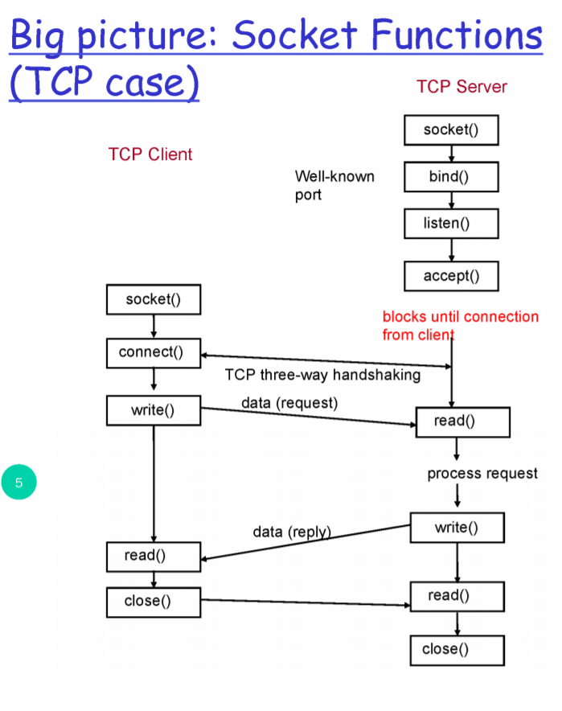

# Socket Programming

## 01. 소켓이란?
* an interface between application and network 
* OS 라는 우체통의 입구와 같음.
* 한 프로세스에서 다른 프로세스로 데이터 전송하는 데 이용 
* [참고](https://levelup.gitconnected.com/operating-system-concepts-sockets-a78ddb9b5f9c)
---
## 02. 소켓의 종류

### 1. SOCK_STREAM (소켓 스트림) : TCP 기반 소켓
* relaible
* in-order guaranteed
* connection-oriented
* **bidirectional**

### 2. SOCK_DGRAM (소켓 데이터그램) :UDP 기반 소켓
* unreliable
* no order guaranteed
* no notion of "connection" - app indicates dest. for each pocket
* can send or receive

---

## 03. Sockets API
> OS가 제공하는 시스템 콜 중 네트워크 관련 기능을 하는 시스템 콜의 집합

* Creation and Setup
* Establishing a Connection (TCP)
* Sending and Receiving Data
* Tearing Down a Connection (TCP)

### (Overview) Socket Function의 큰 그림 (TCP case)

#### [서버 측]

1 - `socket()` : 소켓을 생성

2 - `bind()` : 소켓을 80번 포트에 바인드

3 - `listen()` : 이 소켓을 서버 측에서 클라이언트의 요청을 기다리는 용도로 사용할 것임을 명시.

4 - `accept()` : 클라이언트의 TCP 요청을 받아들임. 요청이 오기 전까지는 대기상태.

5 - `read()` 

6 - `close()` : 자원 해제

#### [클라이언트 측]

3 - `socket()` : 소켓을 생성

4 - `connect(매개변수 : 서버 주소)` : 랜덤 포트 배정하여 서버에 연결 => 연결완료

5 - `write()`

---

### 1. Socket Creation and Setup
#### 1-1. socket 시스템콜
`int socket (int domain, int type, int protocol);`
* 소켓을 생성하는 함수
* 리턴 값 : 이 소켓을 지칭할 번호 (=sockfd, socket file descriptor)
* 두 번째 파라미터 : TCP or UDP
#### 1-2. bind 시스템콜
`int bind (int sockfd, struct sockaddr* myaddr, int addrlen);`
* 생성한 소켓에 특정 포트번호를 바인드하는 함수
* sockaddr 구조체 : IP 주소, 포트번호 등의 요소(element)를 포함함.
#### 1-3. listen 시스템콜
`int listen (int sockfd, int backlog);`
* 생성한 소켓을 서버에서 요청을 기다리는 소켓으로 쓰겠다는 것
* 여러 클라이언트로부터 동시에 TCP 요청을 받았을 경우를 대비하여 Buffer를 준비
#### 1-4. accept 시스템콜
`int accept (int sockfd, struct sockaddr* cliaddr, int* addrlen);`
* 리턴값 : file descriptor 혹은 -1
* accept() 호출 시 => 실제 요청을 받기 전까지 blocking 상태로 들어감.
* 클라이언트의 요청이 들어오면 클라이언트의 주소가 두 번 째 파라미터 `cliaddr`로 들어옴. 그리고 이 함수가 리턴이 되면 이 변수를 통해서 클라이언트의 정보를 알 수 있다.

### 2. Establishing a Connection (TCP)
#### connect 시스템콜
`int connenct (int sockfd, struct sockaddr* servaddr, int addrlen);`
* 서버와 TCP 커넥션 생성
* 서버의 IP주소와 포트번호를 매개변수 `servaddr`로 받음

### 3. Sending and Receiving Data
#### 3-1. write 시스템콜
`int write (int sockfd, char* buf, size_t nbytes);`
* 메시지를 담음
#### 3-2. read 시스템콜
`int read (int sockfd, char* buf, size_t nbytes);`
* 메시지를 읽음
### 4. Tearing Down a Connection (TCP)

#### close 시스템콜

`int close (int sockfd);`
* 포트 등의 자원(resource)을 해제(release)

> Tip : Release of ports
강제종료 시 자원 해제가 제대로 안되는 경우가 있으므로
`signal(SIGTERM, claenExit);`
`signal(SIGINT,claenExit);`
이렇게 해주면 됨.

---

### (참고) UDP
`sendto`
`receivefrom`
