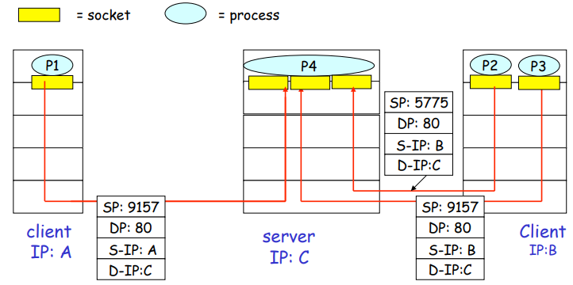

# 3. 전송계층 (Transport layer)

- application 계층 바로 밑에 존재 -> 응용계층보다 좀 더 구체화 된 계층
- TCP와 UDP 존재
- UDP는 TCP에 비해 제공하는 기능이 별로 없음 ( -> TCP 중점적으로 다룸)

 

---

## 3.1.  Transport-layer services

- 인터넷은 ip 프로토콜을 사용하는 디바이스들의 연결

- HTTP 같은 application 전송단위를 `MESSAGE` 라고 부르는데, 이 메세지가 소켓을 통해 응용계층에서 전송계층으로 내려오게 되면 전송계층의 단위인 `segment` 안의 `data` 부분 안으로 들어감.
- segment는 `DATA` 부분과 `HEADER` 부분으로 이루어져 있음. (`HEADER` : DATA의 부가적인 설명이 들어가는 곳)

- 출처 : https://k-elon.tistory.com/36

 

---

## 3.2.  다중화(multiplexing) & 역다중화(demultiplexing)

**TCP와 UDP가 공통적으로 제공하는 기능**

Transport 계층은 기본적으로 목적지 프로세스에 알맞게 전달해주는 일을 함

### 다중화(multiplexing)

: 출발지 호스트에서 소켓으로부터 데이터를 전달받아 데이터를 모으고, 이를 세그먼트 단위로 묶어 생성하기 위해 세그먼트 앞에 헤더를 붙여 캡슐화하여 네트워크 계층으로 내려보내는 작업 

=> **데이터를 보내기 전에 모으는 것**

### 역다중화(demultiplexing)

: 전송계층 세그먼트의 데이터를 올바른 소켓으로 전달하는 작업 

=> **데이터를 받아서 나눠서 애플리케이션에서 필요한 적절한 곳에 보내는 것**

 

---

## 3.3.  Connectionless Transport(비연결형 전송) : UDP

- Connectionless : 소켓과 소켓 사이에 1-1 mapping이 없는 것

- `SP` : source port,  `DP`: destination port

- P1도 P3로 보내고 있고, P2도 P3로 보내고 있음 -> 1-1 매핑 없음 (== connection 없음).

  **즉, 동일한 Source Port 와 Destination Port 라면 서로 다른 Segment들도 같은 소켓으로 전달된다.**

▶ **UDP에서는 다중화, 역다중화를 단순히 포트번호만 보고 함.**

 

---

## 3.4.  연결지향형(Connection-oriented) : TCP

- Connection 존재 -> 소켓과 소켓 1-1 관계

- P1-P4,  P5-P3,  P6-P2 연결되어있음

- 모든 세그먼트들의 DP:80(Web server)임. 그럼 포트번호가 전부 80이므로 동일한 소켓인 것인가? → Nope! 다 다른 소켓으로 가고 있음. (**소켓 ≠ 포트번호**. 소켓이 좀 더 구체화된 개념.  소켓을 지칭할 때 포트번호가 하나의 엘리먼트로 사용되는 것임)

  *(지금까지 이해가 쉽도록 각 소켓은 자기자신의 고유의 포트번호를 가진다고 배웠지만 실제로는 아님. TCP 소켓들은 고유의 id 인덱스를 가진다.)*

▶ **TCP 소켓은 4개의 요소(`source IP`, `source port #`, `dest IP`, `dest port #`)로 구성된 집합에 의해 식변됨.**

- 웹 서버는 각각의 클라이언트의 접속에 대해 서로 다른 소켓을 이용한다.

- A의 프로세스인 P1이 C의 프로세스P4에게 데이터를 보낼 때, 출발지IP: A, 출발지 포트: 9157, 도착지IP: C, 도착지포트: 80으로 보낸다.

  B의 프로세스인 P2와 P3가 C에게 데이터를 보내려고 할 때, P2와 P3의 필드 4개가 전부 동일하지 않기 때문에 P2와 P3의 세그먼트는 C에 도착하더라도 서로 다른 소켓으로 향하게 된다.

  **즉, 동일한 Source Port 와 Destination Port 를 가졌다 하더라도 S-IP, D-IP 값이 다르다면 서로 다른 소켓으로 전달된다.**

 

---

웹 서버 프로세스는 80번 소켓을 가지고 있고, accept를 호출하는 순간 blocking하면서 클라이언트로부터 TCP connection 요청을 기다린다.

클라이언트로부터 TCP connection이 제대로 연결되면 accept call이 리턴되는데, 이 리턴값이 **새로운 소켓 id** 이다. 

리턴되는 순간 Web server에서 새로운 소켓이 생기면서 TCP 커넥션이 생긴다. 

처음 이 과정을 거치고 나면 HTTP request response가 유일하게 맺어져 그 다음부터는 바로 연결이 가능하다.

- 하나의 프로세스가 여러개의 소켓 가질 수 있음
- P1, P2, P3 모두 4개의 서로 다른 필드를 가지고 있어 서로 다른 소켓으로 향하지만 결과론 적으로 같은 프로세스인 P4로 향함.
- P4: Threaded Server

 

---

## UDP

[그림] UDP segment

- header의 필드 4개
- length : 전체 세그먼트의 길이에 대한 정보. 다음 세그먼트가 어디서 시작되는 알 수 있음.
- source port, dest port 번호 정보를 헤더에 넣은 이유 : 다중화(multiplexing) & 역다중화(demultiplexing) 하기 위해
- 헤더의 크기는 작을 수록 좋음. (진짜 보내려는 메세지는 data에 담겨 있고, 헤더는 부가적인 메세지이기 때문)
- sp, dp 각각 16bits가 엔지니어적 측면에서 best. -> 한 machine에서 사용할 수 있는 포트번호는 최대 2^16 -1개.
- 헤더 디자인 == 프로토콜 디자인 -> 프로토콜이 하는 기능

- `checksum` : 에러 발생시 확인할 수 있게 해주는 코드 **-> UDP는 에러 감지를 해준다.**

  그래서 UDP로 보내면, 중간에 유실될 가능성이 있을 수는 있지만, 엉뚱한 데이터가 상대방 프로세스에 전달되지 않는 것을 보장해준다.

- 어떤 필드들이 필요한지는 어떤 기능을 제공하냐에 관한 것

