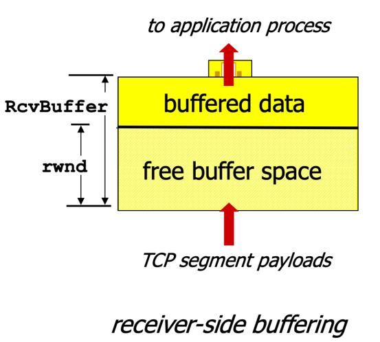
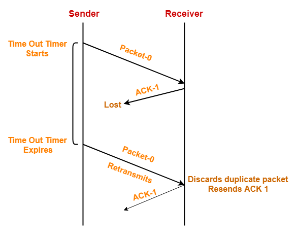
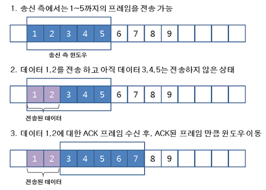
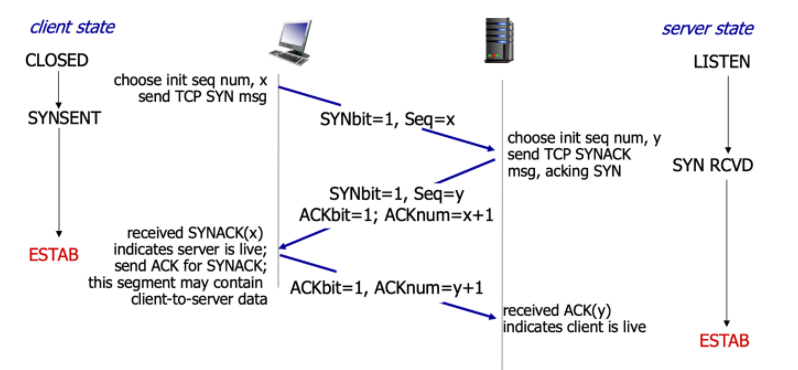
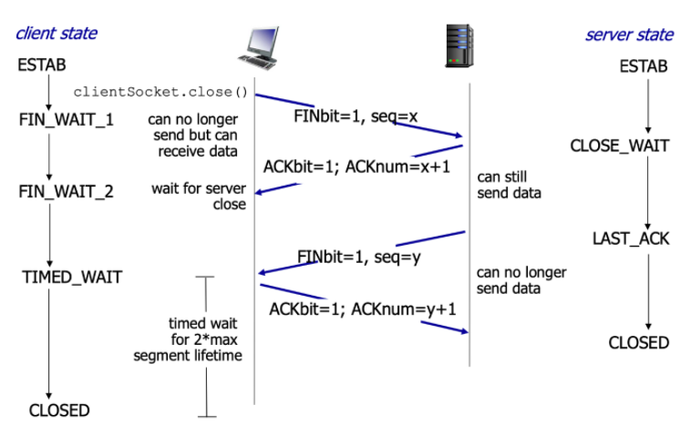

# TCP 흐름 제어

> 수신측이 송신측보다 처리 속도가 빠르다면 문제 없지만, 송식측이 수신측보다 전송 속도가 빠르게 되면 **전송된 패킷은 수신측의 제한된 저장 용량을 초과하여 이후 도착하는 데이터가 손실될 수 있다.** 
>
> 만약 손실된다면 불필요한 응답과 데이터 전송이 송/수신 측 간에 빈번이 발생하기 때문에 이러한 위험을 줄이기 위해 **송신측의 데이터 전송량을 수신측의 처리량에 따라 조절해야 한다.**

 

## Flow Control

receiver의 소켓에 존재하는 버퍼를 기준으로 삼아 소켓의 버퍼에 데이터가 쌓이면 application layer에서 데이터를 계속 가져감.

근데, application layer에서 가져가는 속도보다 버퍼에 데이터가 쌓이는 속도가 더 빠르면 중간에 데이터가 유실될 수 있어 속도를 조절해야 한다.

애플리케이션이 읽는 속도보다 sender가 전송하는 속도가 더 큰 경우 receiver의 buffer에서 오버플로우 발생 가능

- **RWND** : receive buffer에 남아있는 공간 (데이터를 받을 수 있는 공간)
  - segment의 HEADER에 RWND의 정보를 담을 필드 존재
  - receiver의 RWND 크기에 따라 sender의 window size가 조절됨

상대방의 receive 능력만 알면 됨. 직관적으로 알 수 있음

### TCP flow control: when rwnd = 0

receiver에서 응답으로 `rwnd=0` 을 sender에 전달하면 sender는 대기 상태에 빠지고, receive buffer에 공간이 생겨도 응답을 들어 기다리는 상태만 유지되어 **데드락 발생**

-> 해결방법 : sender에서 rwnd=0을 수신한다면 주기적으로 1 byte 크기의 아주 작은 세그먼트(*probe packet*)를 전송하여 응답을 받는 것으로 receiver의 버퍼 상황을 확인한다.

 

## 흐름제어의 기법

### 1. 정지-대기(Stop-and-Wait)

데이터를 1개 보내고 ACK가 오면 그 다음 데이터를 보내는 간단한 방식. 

but, 매번 전송한 패킷에 대해 확인응답을 받기 때문에 속도가 느리고 비효율적

### 2. 슬라이딩 윈도우(Sliding Window)

Stop-and-wait 의 비효율성을 개선한 기법으로 수신 측에서 설정한 윈도우 크기만큼 송신 측에서 확인 응답 없이 세그먼트를 전송할 수 있게 하여 데이터 흐름을 동적으로 조절하는 제어 기법

 

## Silly Window Syndrome: Sender

> Sender가 보내는 방식

- 실제 세그먼트 크기는 얼마가 적당? 

HEADER는 40byte로 고정되어 있으므로, 세그먼트 사이즈가 크면 클수록 오버헤드 비율이 줄어들어 좋음.

application에서 write를 엄청 많이 하면 세그먼트 크기 최대로 만들어서 보내면 됨. (이 경우는 문제 안됨)

근데 write를 아주 천천히 조금조금씩 한다고 하면 세그먼트 크기를 얼마로 해야할 것인가 ?

-> ***(Nagle's algorithm)*** 첫번째 세그먼트는 양이 작아도 일단 보내고, 갔다가 feedback이 올때까지 축적된 데이터가 maximum을 채우면 보내고, 못 채우면 채워진만큼만 보냄.

=> 네트워크 속도에 비해 application이 생성하는 속도가 빠르면 세그먼트 사이즈 커지고, application이 생성하는 속도보다 네트워크 속도가 빠를 경우 세그먼트 사이즈 작아지게 됨.

## Silly Window Syndrome: Receiver

> 굳이 할 필요는 없는데 최적화 시키기 위해 Receiver 측에서 하는 동작들

- Clark's solution : 슬라이딩 윈도우 크기를 0으로 셋팅하여 보내서, 수신 처리 속도가 늦음을 알림

- Delayed ACK : 기본 500ms 보다 더 길게 ACK를 지연 못하도록 규칙을 정함

 

## TCP 3-way handshake

- 첫번째 두번째의 SYN, SYNACK 메세지는 100% control 메세지여서 헤더만 나감
- 세번째의 SYNACK 메세지는 일반 ACK 메세지여서 DATA를 담아서 보낼 수 있음 (-> HTTP request)

 

## TCP: closing a connection

- application에서 `close call` 이 있으면 더이상 보낼 데이터가 없다는 FIN 메세지를 보냄

