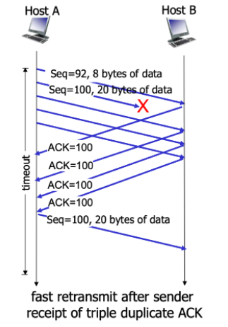

# TCP (전송 제어 프로토콜)

> TCP 통신: 네트워크 통신에서 신뢰적인 연결방식

실제 TCP 동작 방식 :  Pipelined Protocol

신뢰성을 제공하면서 동시에 빠른 속도를 제공

 

## TCP 특징

- point-to-point : 소켓 한쌍을 위해서만 동작
- **reliable(신뢰성)** : 애플리케이션에서 내려온 메세지가 에러없이 유실되지 않고 전달됨 (TCP의 가장 큰 특징)
- in-order byte stream : 애플리케이션에서 내려온 메세지 순서대로 전달됨
- pipelined : 한꺼번에 많은 메세지가 전달 (window 사이즈 만큼)
- full duplex data : sender이자 receiver
- connection-oriented (연결지향) : 1:1로 연결 상태를 유지하여 통신
  - *cf )*  IP & UDP : connectionless 프로토콜
    - 연결 상태를 유지하는 것이 아니라, 주소를 가지고 다음 라우터나 목적지로 전달만 하여 datagram에 대해 관여 하지 않음

 

## 흐름제어 / 혼잡제어

>  TCP 신뢰성을 구성해주는 대표적인 방법

- **Flow Control (흐름제어)** : 송신측과 수신측의 데이터 처리 속도 차이를 해결하기 위한 기법
- **Congestion Control (혼잡제어)** : 송신측의 데이터 전달과 네트워크의 데이터 처리 속도 차이를 해결하기 위한 기법

애플리케이션에서 소켓을 통해 데이터가 내려오는 속도(애플리케이션이 결정) ≠ data segment가 보내지는 속도(tcp가 결정)

data segment의 송신 속도는 수신측 속도에 맞게 보내줌

 

## TCP segment 구조

- sequence number : 수신측에서 새로운 메세지인지 재전송된 메세지인지 구분할 수 있게하는 메세지 트래킹을 위한 도구
- Acknowledgement number : 상대방으로부터 수신한 데이터의 바로 다음에 수신할 데이터 순서 번호
  - ex. `ACK#100` : 99번까지 빠짐없이 잘 받았고, 100번을 받을 차례

 

### TCP Round Trip Time and Timeout

- timer 값 세팅은 `RTT(Round Trip Time) + margin` 으로 한다.
  - ACK 돌아오는 시간을 매번 체크해서 sample RTT를 구함
  - (주의) 재전송한 세그먼트에 대해서는 sample RTT에 포함하지 X
- RTT 값 매번 바뀜 -> EstimatedRTT 사용

 

## TCP reliable data transfer

하나의 소켓에 send buffer, receive buffer, timer 한개 존재

(실제 tcp는 sender이면서 receiver -> seq, ack 각각 존재하는 이유)

- receive buffer 역할 :  in-order-delivery 지원
- send buffer 역할 : 재전송을 위한 버퍼 (혹시라도 재전송해야하는 경우를 위해 send buffer에 잠시 보관해놨다가 확실히 전송이 확인되면 지움)

- 비효율적인 점 : 데이터 유실될 경우, timer가 expire될 때 재전송이 일어남 - margin까지 있어 굉장히 긴 시간 소요
- **(TCP fast retransmit)** 어떻게 하면 timer expire 되기 전에 유실을 판단 ? -> receiver가 같은 데이터에 대해 동일한 3개의 ACK를 수신한다면, ACK를 수신한 데이터 이후에 전송된 세그먼트는 손실된 것으로 간주. (그림상으로 4개의 ACK - 첫 ack는 원래꺼, 이후 3개의 ack 연속)

