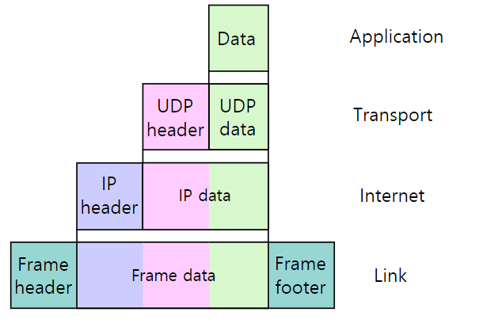
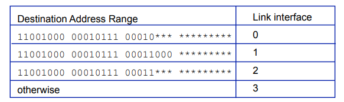
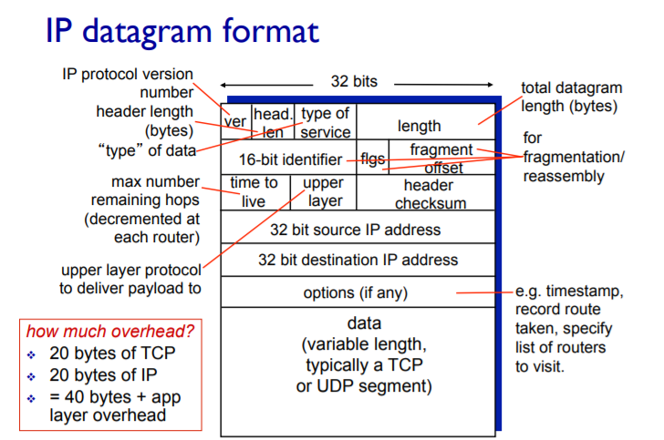
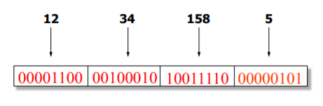
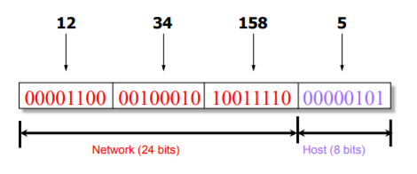
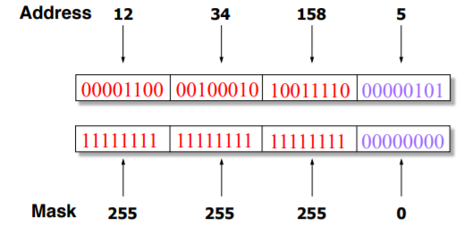
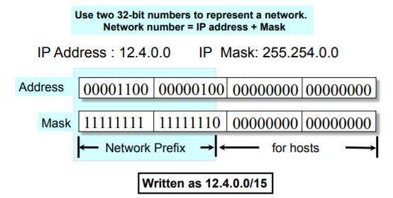
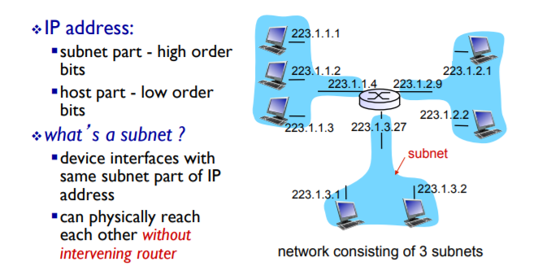
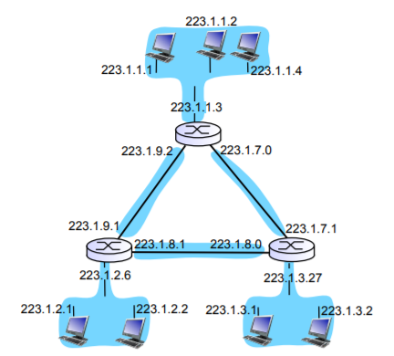

# 4. Network Layer - 네트워크 계층 서비스

애플리케이션(APP) 메세지(MSG)는 TCP세그먼트에 담겨있고, 그 TCP세그먼트는 네트워크 계층의 프로토콜인 IP 패킷의 DATA 부분에 담기게 된다.

- IP패킷이 중요한 이유 : 출발지부터 도착지까지 존재하는 라우터들은 IP패킷으로 쌓여진 정보만을 인식하여 전달할 수 있게 됨.

---

 

## 1. 라우터 (router)

- 라우터 : 인터페이스가 여러개 있는 디바이스. 인터페이스 만큼 IP 주소를 가짐. 각각 인터페이스의 subnet이 다름. [*(2.4 subnets 참고)*](#2-4-subnets-부분망)

 

### 포워딩과 라우팅

> 네트워크 레이어에 반드시 있어야 하는 두가지 기능

- **`forwarding`** : 들어온 패킷의 목적지 주소를 보고 라우터 내부의 포워딩 테이블을 참조하여 동일한 엔트리로 패킷을 이동시키는 것. 빠르게 포워딩 하는게 중요
- **`routing`** : 포워딩 테이블 엔트리를 채우는 일

 

- 현재 IP라우터들은 패킷을 전달할 때 `best-effort` 라는 특성을 가지고 있음.
  - 최선을 다해서 포워딩하지만 유실이 발생할 수 있고, 딜레이가 늘어날 수도 있다. 그래서 상위 TCP에서 보완하는 작업을 미리 수행한 것이다.

- Forwarding Table
  - 엔트리는 실제 주소가 아닌 주소 `range`가 들어간다.
  - longest prefix matching

---

 

## 2. IP: Internet Protocol

### 2-1. IP 패킷의 형태

: DATA 부분에 TCP 세그먼트 담겨져 있음 -> `IP헤더(20bytes) - TCP헤더(20bytes) - APP MSG` -> 40bytes 오버헤드 존재

- time to live (TTL) :  패킷이 영원히 살아있지 못하도록 하는 역할 (중간에 문제가 생겨 무한루프가 발생하는 경우 방지용)

라우터가 포워딩할때마다 ttl에 적힌 숫자를 `-1` 씩 갱신. 도착하기 전까지 0이 되면 그 패킷은 버려짐

- upper layer : 상위 레이어의 종류(TCP, UDP, ... 등등)를 알려주기 위함

- **source IP address** 
- **destination IP address** 

### 2-2. IP Address (IPv4)

- unique 32-bit number
- Identifies an interface (on a host, on a router, ...)

IP주소는 컴퓨터의 호스트 주소를 지칭하는게 아니라 **인터페이스**를 지칭함 !

-> 라우터는 인터페이스마다 IP주소를 여러개 가짐

### 2-3. 어떤 식으로 IP 주소를 배정할 것인가? 

- 가장 직관적인 방법으로 필요할 때마다 배정하면 엔트리 개수가 상당히 커져 scalability 문제 발생

  -> IP 주소 역시 계층화 필요

- Hierarchical Addressing: IP Prefixes

  - Network ID (==prefix ==subnet) / host ID
  - 12.34.158.0/24 is a 24-bit **prefix** with 2⁸ addresses
  - 장점 : 라우터에 들어가는 forwarding table이 훨씬 단순해지고 매칭이 빨라짐

- Subnet Mask
  - 컴퓨터가 이해하기 쉽도록 `/24` 대신 사용하는 네트워크 ID를 표현하는 방식

- Net ID를 24bits, Host ID를 8bits로 고정시켰을 때 문제점 : 네트워크 기관별로 사이즈가 각각 다름

- **Classless Inter-Domain Routing (CIDR)** 

  - class라는 개념없이 가변적으로 사용
  - 네트워크 블럭을 기관에게 배정할 때 각 기관의 사이즈에 맞게 설정해서 줌

  

  - network 15bits / host 17 bits -> 2¹⁷ 개의 host를 지원

### 2-4. Subnets (부분망)

> IP 클래스의 비효율성 문제를 해결하기 위해 IP를 사용하는 네트워크 장치 수에 따라 효율적으로 사용할 수 있도록 하기 위해 등장

동일한 네트워크 아이디를 가지고 있는 인터페이스들의 집합

- 보통의 호스트는 하나의 subnet에 속해있지만, **라우터는 여러개의 subnet에 속해있는** 중간자(교집합)이다.
- -> 다른 subnet에 접근하기 위해서는 공유지역의 러우터를 거쳐갈 수 밖에 없다.

 

[그림] 라우터의 인터페이스 3개. 각각 IP 주소 가지고 있음. 그 IP 주소의 subnet 다 다름.

### [Quiz] How many Subnets ?

답: 6개

### (참고) Obtaining a Block pf Addresses

- Internet Corporation for Assigned Names and Numbers (ICANN)
- Regional Internet Registries (RIRs)
- Interner Service Providers (ISPs)

