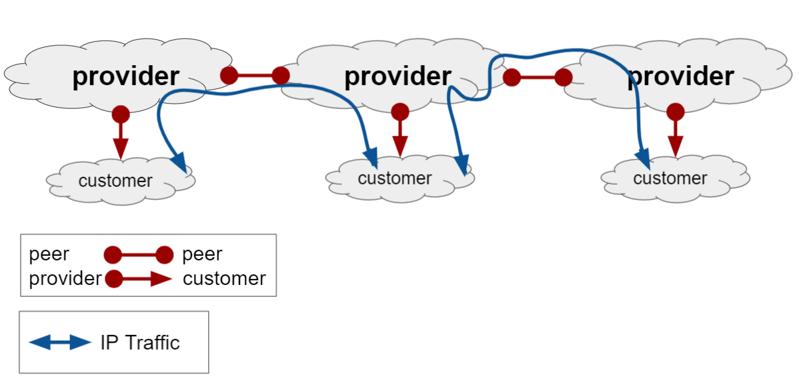

# 계층적 경로 변경

> 실제 네트워크 조건에서 링크상태, 거리벡터 알고리즘을 적용하는 데 한계가 있다.(large scale의 scalability문제) 

#### => 해결방법은? 계층화!

## Hierachical routing

## 라우팅 프로토콜
1. RIP : 거리벡터 알고리즘 사용 (개별 네트워크 내부)
2. OSPF : 링크상태 알고리즘 사용 (개별 네트워크 내부)
3. **BGP** : 네트워크 사이 라우팅 프로토콜

## inter-AS(Autonomous System) 프로토콜 - BGP(Border Gateway Protocol)

* AS(Autonomous System) : 각 네트워크 내부의 정책(예:라우팅 알고리즘)은 자치적으로 결정한다는 의미, 네트워크 기관 또는 ISP(Internet Service Provider)라고도 함. 
  *  예시) 이화여자대학교, KT 등

* ASNs(AS Numbers) : 각 AS를 구별하기 위한 globally unique한 번호

### Realationships Between Networks(AS 사이의 관계)

#### Some costs of running an ISP
* People
* Physical connectivity and bandwidth
* Hardware
* Data center space and power

=> A lot of money...

#### 관계 - 1. Customers and Providers

=> Cusomer pays provider for access to the Internet.

예) 이화여자대학교(customer) - KT(provider)

#### 관계 - 2. The Peering Relationship

예) SKT - KT
