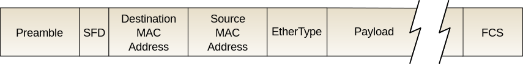

# Link layer (2)

## 1. 이더넷

## 이더넷 프레임과 맥 주소(MAC Address)

: 프레임의 Source, Destination 주소는 IP 주소가 아닌 MAC 주소이다.

### IP Address vs. MAC Address(=LAN/Ethernet/Physical Address)

|IP | MAC|
|---|----|
|32bit|48bit(제조사24bit+제품일련번호24bit)|
|Network layer|Link layer|
|서브넷이동 시 주소값이 변함|고유한 값으로 변하지 않음|

### ARP(Address Resolution Protocol)

#### Question : Link 계층의 전송 단위인 패킷은 목적지의 MAC 주소를 알아야 한다. 그런데 IP주소만 가지고 어떻게 MAC 주소를 알아낼 수 있을까?

* (참고) 패킷을 보낼 다음 GWR(GateWay Router)의 IP주소는 DHP를 통해 구성한 Forwarding Table 을 이용하여 알아낸다.

|DST|Next-hop(NOTE:NOT a Destination)|
|---|------------------------|
|,|1.1.1.1(GWR)|

=> 브로드 캐스팅 질의와 그에 대한 응답을 통해 IP - MAC 매핑정보를 얻는다.

이 때, 매핑정보를 얻기위한 요청/응답과 실제 데이터 전송을 구분하기 위해 TYPE 필드(ARP~ or IP Packet)를 이용한다.

1. ARP query & ARP response
  * 요청 내용 : IP주소가 1.1.1.1인 호스트는 당신의 MAC 주소를 응답해주세요
  * 요청 프레임 구성
    * type : ARP query
    * data : 1.1.1.1 에 대한 ARP query
    * src : 송신 MAC주소
    * dst : FF FF FF FF FF FF (=브로드캐스팅)
  * 응답 프레임 구성
    * type : ARP response
    * data : 1.1.1.1 에 대한 ARP response
    * src : IP주소가 1.1.1.1인 호스트의 MAC주소
    * dst : 요청을 보낸 호스트의 MAC주소
  
2. ARP table 을 구성, 캐싱

  |IP|MAC|TTL|
  |---|---|
  |1.1.1.1|GWR MAC addr|60|
  
3. ARP table 을 Look-up하여 이더넷 패킷 구섣

## 스위치
: 실제로는 BUS topology 가 아닌 스위치를 이용한 STAR topology를 많이 사용함

* 스위치의 여러 인터페이스에 각 호스트를 연결하여사용함
* 호스트 입장에서는 링크 하나만 연결된 것 처럼 보임
*  collision detection 안되어 동시에 서로 다른 호스트가 프레임을 전송할 수 있음, 그런데..

#### Question: 어떤 호스트가 어떤 인터페이스 쪽에 존재하는지 어떻게 알지? => switch table

### self -learning 을 통한 switch table 구성

---

## 2. LANs
