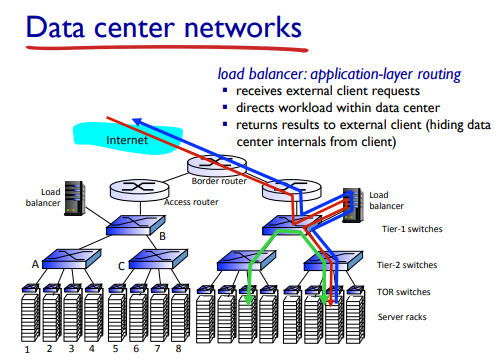
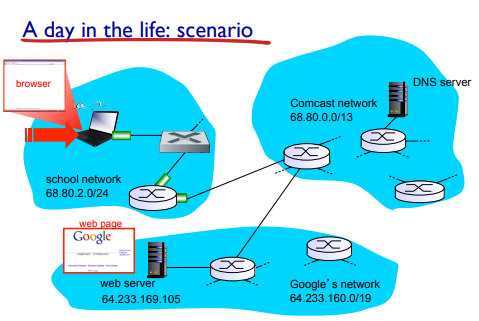
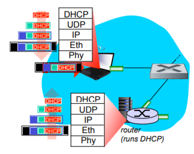
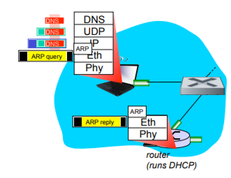
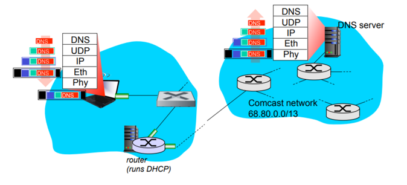
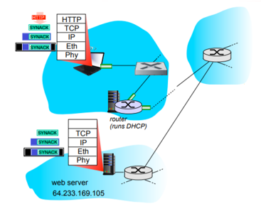
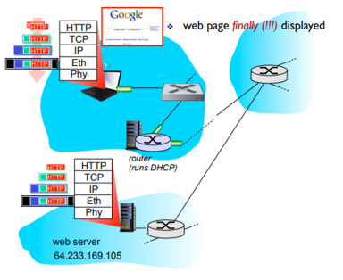

# `google.com` 검색 시 일어나는 과정

## Overview

DNS에서 IP 주소로 변환 후 서버에 요청을 보내는데, 이때 서버는 엄청 나게 많다.

그림처럼 엄청 많은 서버들을 차곡차곡 쌓아서 스위치로 연결한 후, 다른 스위치랑 연결하며 계층화한다. 이렇게하면 서버 규모가 계속해서 크게 확장될 수 있다.

이렇게 엄청나게 많은 서버를 스위치로 연결하고, 사용자의 request가 들어오면 여유있는 서버에 배치하여 response해준다.

- `Data center` : 서버를 모아둔 곳

*tmi )* 보통 데이터센터를 시골 강가 근처에 짓는데, 땅값때문도 있고 열기가 엄청나기 때문. 냉각수로 열을 식힌다

 

## Detail

### 1. connecting to the Internet

1. 노트북을 연결하려면 IP 주소가 필요한데, 아무 정보가 없기 때문에 네트워크 정보를 얻기 위해 DHCP를 사용한다.
2. UDP를 통해 전송되는 DHCP (broadcast message)가 IP패킷에 담기게 된다.
   이더넷 프레임의 목적지 주소 : FFFFFFFFFFFF,  소스 주소 : 인터페이스의 MAC 주소
3. DHCP 메세지가 라우터로 갔을 때 self running이 일어난다. (소스 mac 주소 아니까)
4. 클라이언트는 이제 IP 주소를 가지고 있으며 DNS 서버의 이름 및 주소, 첫 번째 홉 라우터의 IP 주소를 알고 있다.

### 2.  ARP (before DNS, before HTTP)

1. HTTP request의 목적지 IP주소를 모르기 때문에 알기 위해 DNS 작업을 해야 한다.
   DNS 쿼리가 담기는 IP패킷의 source는 클라이언트의 IP주소, dest 주소는 DNS 서버의 IP주소. 
2. 포워딩테이블 look up해보면 next up은 게이트웨이 라우터. 이 게이트웨이 라우터의 IP주소는 아는데 mac 주소는 모름. 프레임을 라우터로 보내기 위해(완성하기 위해), ARP를 lookup한다. 
3. ARP 테이블이 없기 때문에 ARP request 쿼리가 라우터로 나감. (ARP쿼리 역시 이더넷 프레임에 담겨져 나감)
4. ARP 쿼리를 통해 ARP 테이블이 채워지게 되고, 게이트웨이 라우터의 MAC 주소가 entry하게 된다. 이 이후로는 테이블 look up만 하면 됨

### 3. using DNS

1. 프레임 만들어져서 나감

### 4. TCP connection carrying HTTP

DNS 통해서 IP주소 알아오게 되면, HTTP request 나가야 하는데 그 전에 TCP connection setup해야함. =>

1. TCP SYNACK message

### 5. HTTP request/reply 

