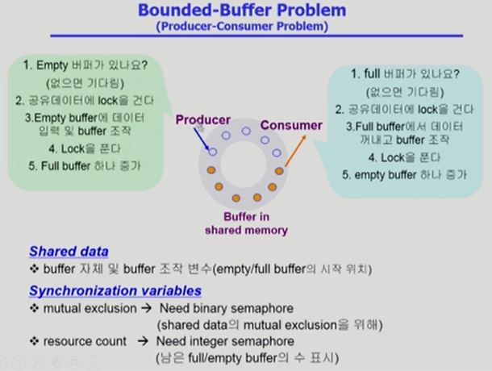
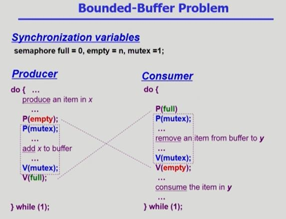
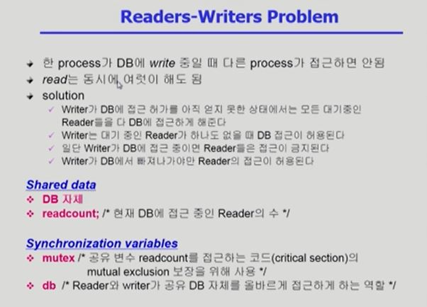
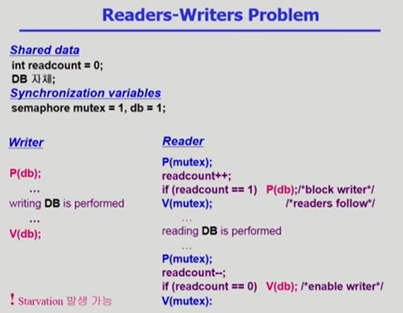
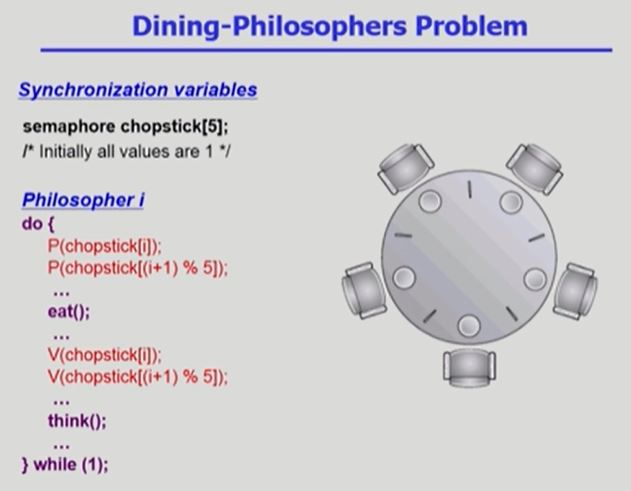
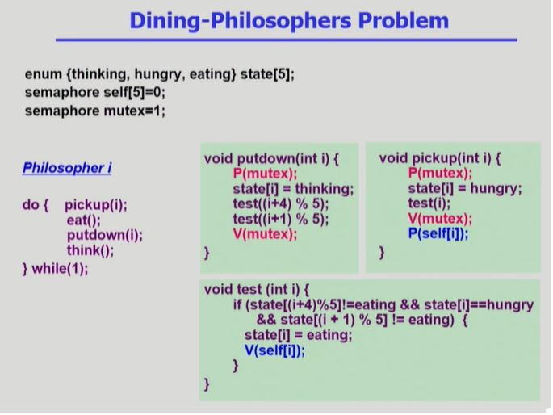
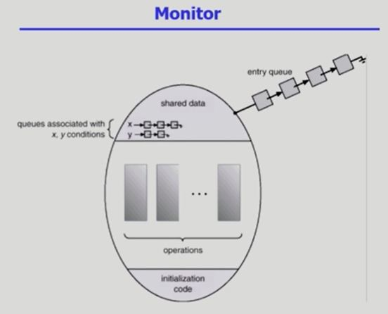

# Process Synchronization, Concurrency Control (3) (프로세스 동기화, 병행제어)
 
## 01. Overview : Process Synchronization의 고전적 문제와 세마포어를 이용한 해결
### 1. Bounded-Buffer Problem
### 2. Readers-Writers Problem
### 3. Dining-Philosophers Problem

--- 

<br>

## 1. Bounded-Buffer Problem (=Producer-Consumer Problem)

<br>

> 다수의 Producer(생산자) 프로세스와 다수의 Consumer(소비자) 프로세스가 **유한**한 크기의 공유 버퍼를 사용한다.

<br>



<br>

- Semaphore 변수
    - 공유자원 관리
        - mutex : lock 걸기 위한 변수
    - 가용자원 counting
        - full : 내용이 들어있는 버퍼 개수 저장 변수
        - empty : 비어있는 버퍼 개수 저장 변수

- 생산자 프로세스의 자원 : empty 버퍼
- 소비자 프로세스의 자원 : full 버퍼

### semaphore 로 구현한 Bounded-Buffer Problem 해결 pseudo code

<br>



<br>

## 2. Readers-Writers Problem

<br>

> 다수의 Reader 프로세스와 다수의 Writer 프로세스들이 하나의 저장 공간(버퍼)을 공유하며 이를 접근한다. **여러 명의 독자가 동시에 데이터를 읽어오는 것은 가능**하다.

<br>



<br>

- semaphore 변수
    - db : DB r/w 에 대한 lock
    - mutex : **readcount** 에 대한 lock

<br>

### semaphore 로 구현한 Readers-Writers Problem 해결 pseudo code

<br>



<br>

## 3. Dining-Philosophers Problem

<br>

> 동시성과 교착 상태를 설명하는 문제로, 멀티프로그래밍 환경에서 교착 상태가 발생하는 원인을 직관적으로 알 수 있다.

<br>



<br>

### semaphore 로 구현한 Dining-Philosophers 해결  pseudo code

<br>



<br>

=> 식사하는 철학자 문제는 모니터로 해결하는 방식을 이해하는 것이 더 쉽다.

---

<br>

## 02. 모니터(Monitor)

<br>

### 02-1. 세마포어의 단점  

* 코딩이 힘들다
* 정확성(correctness) 입증이 어렵다
* 자발적 협력(voluntary cooperation)이 필요하다 
* 프로그래머의 실수가 시스템에 중대한 영향을 미칠 수 있다.    
    예)
    ```c
    // mutual exclusion 깨짐
    V(mutex)
    Critical section
    P(mutex)
    ```

    ```c
    // deadlock 발생
    P(mutex)
    Critical section
    P(mutex)
    ```              

<br>

### 02-2. 모니터 정의

: 동시 수행중인 프로세스 사이에서 abstract data type의 안전한 공유를 보장하기 위한 
**high level** synchronization construct.

```c
monitor monitor-name
{
    shared variable declarations
    procedure body P1(...){
        ...
    }procedure body P2(...){
        ...
    }
    procedure body P3(...){
        ...
    }
    {
        initialize code
    }
}    
```
    
<br>

* Monitor diagram

    

<br>

### 02-3. 모니터 특징

* 모니터는 그 내부에 공유데이터와 그 접근을 위한 프로시저가 구현되어 있어(객체지향)

    1. 프로시저를 통해서만 공유데이터 접근
    2. 동시에 여러 프로시저 실행 불가능

하므로 프로그래머가 직접 lock 을 걸고 풀지 않아도 된다.

=> 모니터 내에서는 한 번에 하나의 프로세스만 활동 가능

==> 프로그래머가 동기화 제약 조건을 명시적으로 코딩할 필요 없다

<br>

### 02-4. 모니터 구성

* condition variable
    
    프로세스가 모니터 안에서 기다릴 수 있도록 하는 역할
    `condition x,y;`

* condition variable는 wait와 signal 연산에 의해서만 접근 가능
    
    * wait()

        `x.wait();` 을 invoke 한 프로세스는 다른 프로세스가 `x.signal()`을 invoke 하기 전까지 suspend 시킨다.

    * signal()

        `x.signal()`은 정확하게 하나의 suspend된 프로세스를 resume 한다.

        suspend된 프로세스가 없으면 아무 일도 일어나지 않는다.
    

<br>

### 02-5. 모니터를 이용한 Bounded buffer 문제 해결 pseudo code

<br>

```c
monitor bounded_buffer
{
    int buffer[N];
    condition full, empty;
    /* condition var.은 값을 가지지 않고 자신의 큐에 프로세스를 매달아서(suspend) sleep 시키거나 큐에서 프로세스를 깨우는 역할만 함*/

    void produce(int x)
    {
        if there is no empty buffer
            empty.wait();
        add x to an empty buffer
        full.signal();
    }

    void consume(int* x)
    {
        if there is no full buffer
            full.wait();
        remove an item from buffer and store it to *x
        empty.signal();

    }
}
```

<br>

[참고 : 모니터](https://ko.wikipedia.org/wiki/%EB%AA%A8%EB%8B%88%ED%84%B0_(%EB%8F%99%EA%B8%B0%ED%99%94))

[참고 :semaphore와 monitor](https://www.geeksforgeeks.org/monitor-vs-semaphore/)
