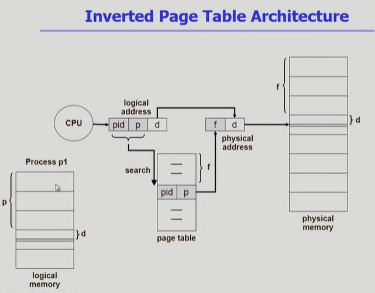

# Memory Management (4)

## 1. Overview : Allocation of Physical memory issue

1. Contiguous allocation (연속할당)

    1-1. Fixed partition allocation (고정분할)

    1-2. Variable partition allocation (가변분할)

2. Noncontiguous allocation (불연속할당)

    2-1. **Paging**

    2-2. Segementation

    2-3. Paged Segmentation, Segment with page

--- 

 

## 1. Multilevel Paging

: 각 단계별 테이블을 차례로 접근해야 하므로 주소변환을 위해 단계 + 1 번의 메모리 접근이 필요.

=> TLB를 활용하여 메모리 접근 시간을 줄일 수 있음.

 

## 2. Memory Protection 

1. Protection bit : page에 대한 접근권한을 의미(read/write/readonly)
    * code : 수정되어서는 안됨
    * data, stack : 수정, 변경 가능
2. Valid / Invalie bit
    * Valid (v) : 해당 주소의 frame 에 그 프로세스를 구성하는 유효한 내용이 있음을 의미
    * Invalid (i) : 해당 주소의 frame에 유효한 내용이 없음
        * 프로세스가 그 주소부분을 사용하지 않은 경우
        * 해당페이지가 메모리에 올라와있지 않고 swap area에 있는 경우

 

## 3. Inverted Page Table

: 페이지테이블이 차지하는 공간을 줄이기 위해 기존방식(각 프로세스가 page table을 가짐)과 달리 시스템이 단 하나의 page table 만을 가짐(system wide)

### 특징 

* 공간 효율적 이용 측면에서 유리
* 시간적 측면에서 불리할 수 있으므로 associative register를 사용하여 병렬 탐색(-> expensive)
* 페이지 테이블의 크기는 물리 메모리의 페이지 프레임 개수이며, 페이지에 저장되는 정보는 프로세스 아이디와 페이지번호임.

### 주소변환 과정
1. 논리주소의 pid(현재 CPU를 점유중인 프로세스의 아이디)와 p를 페이지 테이블에서 탐색
* 인덱스로 접근 불가능 하므로 순차 탐색 필요
2. 그 엔트리의 위치값(=f)을 page frame 번호로 하여 물리 메모리 참조

 

## 4. Shared Page

page에 포함된 공유가능한 code에 대해서 readonly로 세팅하여 한 번만 물리적 메모리에 올림
* shared code, re-entrant code, pure code

